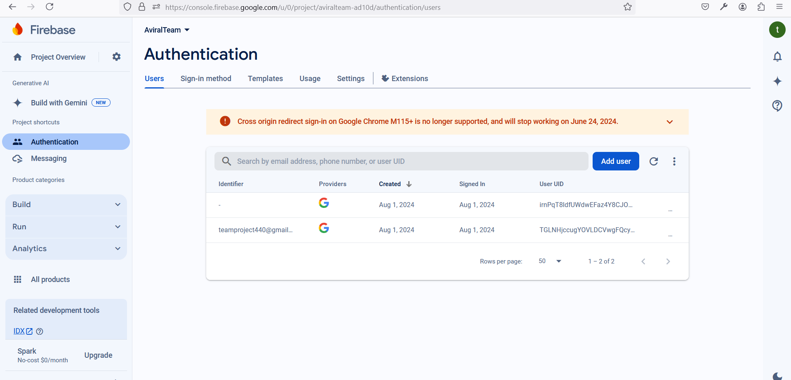

# How to install firebase AUTH google account with React 

 ## Firebase Authentication Setup

### Make sure that Google Sign-In is enabled in your Firebase Console:

- Go to the Firebase Console.
-  Select your project.
- Navigate to "Build" > "Authentication" > "Sign-in method".
- Enable the "Google" sign-in provider and save your changes.

# Install Dependencies

- First, you need to install Firebase and React Firebase Hooks. Run the following command in your project directory:

>- npm install firebase react-firebase-hooks
